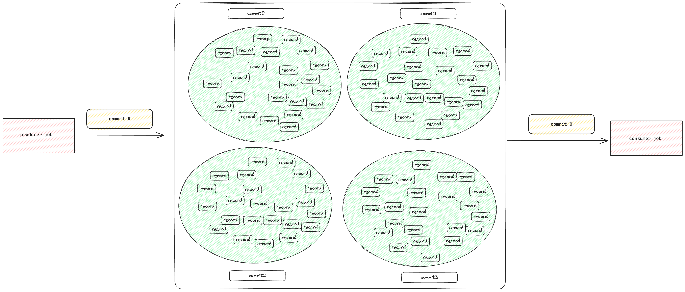
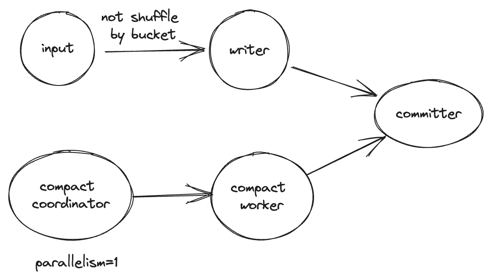
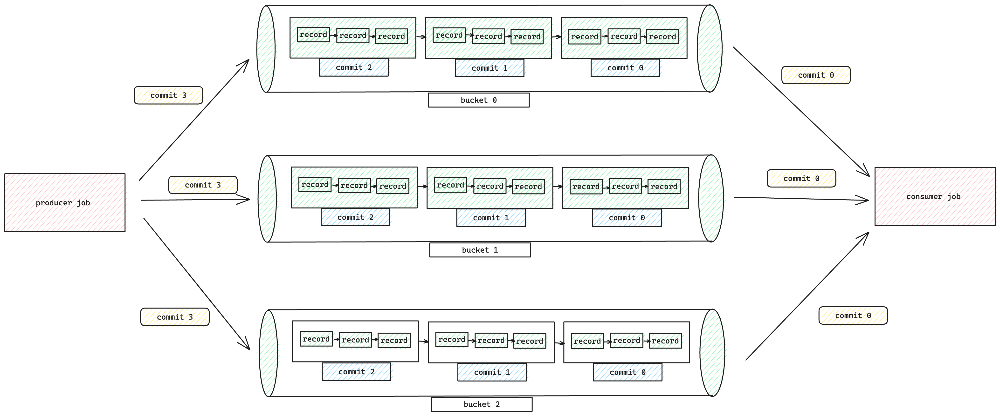

# Append Only Table

如果表没有定义主键的话，那么这个表默认为append-only表，根据定义好的bucket数对数据进行划分。
这里有两种append-only模式，

- Append For Scalable Table
- Append For Queue

## Append For Scalable Table

### 定义

定义`'bucket' = '-1'`即启用了Append For Scalable Table也就是paimon内部称为`unaware-bucket`模式，
在这个模式下，所有行为都跟其他bucket模式有所区别。

当启用了`unaware-bucket mode`时，bucket的概念就消失了，paimon也不再保证流读的record顺序。
paimon认为这种表属于或用于离线批读的表（当然也可以流读、或流写入这个表）。
并且启用`unaware-bucket mode`时所有的数据都会往一个目录写（为了兼容原有的逻辑，数据会写入`bucket-0`目录下）。
正因为没有了bucket的概念，对输入的数据也不会进行shuffle操作，这会提升插入inserting的速度。



Using this mode, you can replace your Hive table to lake table

#### Testing

```sql
create table T
(
    id   int,
    name varchar
)
    with (
        'bucket' = '-1'
        );
insert into T
values (1, 'hello'),
       (2, 'world');
select *
from T; -- output 1,hello;2,world
insert into (3, 'huawei');
select *
from T; -- output 1,hello;2,world;3:huawei

➜  T
tree .
.
├── bucket-0
│   ├── data-132093c5-b7e5-4598-93d6-27d61ca8ef26-0.orc
│   ├── data-39141eb6-f337-41bf-af14-2564e71bbfb8-0.orc
│   └── data-b44df854-4837-4a03-b69f-637381336565-0.orc
├── manifest
│   ├── manifest-2a40b2d1-0e4d-42d6-85df-60b973282146-0
│   ├── manifest-db30d5a7-bad2-429a-9acd-aa8b128205d6-0
│   ├── manifest-list-4e3b340e-819b-4f33-b230-5b21c8ba0a01-0
│   ├── manifest-list-4e3b340e-819b-4f33-b230-5b21c8ba0a01-1
│   ├── manifest-list-5a115d01-4ff2-42a8-90c4-00f387468558-0
│   └── manifest-list-5a115d01-4ff2-42a8-90c4-00f387468558-1
├── schema
│   └── schema-0
└── snapshot
├── EARLIEST
├── LATEST
├── snapshot-1
└── snapshot-2
```

### Compaction

在unaware-bucket模式下，paimon不会在writer中执行compaction操作，会改为使用`Compact Coordinator`去
扫描小文件再提交一个compaction任务到`Compact Worker`。
通过这种方式可以轻松地并行压缩一个简单的数据目录。
在流模式下，如果在 flink 中运行 insert sql，拓扑结构将如下所示：


该操作会尽最大努力压缩小文件，但当一个分区中的单个小文件长期存在且分区中没有添加新文件时，
Compact Coordinator会将其从内存中删除，以减少内存使用。重新启动任务后，
paimon还是会扫描小文件并再次将其添加到内存中。控制压缩行为的选项与 Append For Qeueue 完全相同。
如果将`write-only`设置为 `true`，Compact Coordinator和Compact Worker将从拓扑中移除。

只有使用Flink引擎并且出于streaming模式下自动压缩才会启用，也可以通过`flink-action`启动compaction作业。

### Sort Compact

每个分区中的数据如果不按顺序排列，会导致查询速度变慢，压缩也会减慢插入速度。
为插入任务设置只写是个不错的选择，在每个分区的数据完成后，触发分区排序压缩操作。
更多查看[Sort Compact]()

### Streaming Source

unaware-bucket模式的append-only表支持流式读写，但不再保证顺序。不能把它看作一个队列，
而应把它看作一个带有存储仓的湖。每次提交都会生成一个新的record bins，
我们可以通过增量读的方式读取新的record bin，但再一个record bin里数据顺序随心所欲，
读回来的时候顺序存在任何可能。 而在`Append For Queue`模式下，记录records就不是存储
在record bins里了而是record pipe。

### Streaming Multiple Partitions Write

由于 Paimon-sink 需要处理的写任务数为：写入数据的分区数 * 每个分区的桶数。
因此，我们需要尽量控制每个 paimon-sink 任务的写任务数，
使其分布在合理的范围内。如果每个sink-task处理的写任务过多，
不仅会造成小文件过多的问题，还可能导致OOM。

此外，写入失败会引入孤儿文件，这无疑会增加 paimon 的维护成本。我们需要尽可能避免这个问题。

对于启用了自动合并功能的flink任务，
建议尝试按照以下公式来调整 paimon-sink 的并行性（这不仅适用于append-only表，实际上适用于大多数情况）：

```
(N*B)/P < 100 (该值需要根据实际情况进行调整)
N (写入数据的分区数)
B (bucket数)
P (paimon-sink并行度)
100 (这是一个根据经验得出的阈值，对于禁用了自动合并的flink作业，这个值可以降低。
     但请注意，你只是将部分工作转移给了 user-compaction-job，
     本质上你仍然需要处理这个问题、您需要处理的工作量并没有减少，
     user-compaction-job 仍需根据上述公式进行调整。)
```

还可以将 `write-buffer-spillable` 设置为 `true`，写入器可以将记录溢出到磁盘。
要使用这个选项，你需要为你的 flink 集群准备一定大小的本地磁盘。
这对于在 k8s 上使用 flink 的用户尤为重要。

对于 append-only-table 表，你可以为 append-only 表设置 `write-buffer-for-append` 选项。
将此参数设置为 `true`，写入器将使用Segment Pool缓存记录，以避免 OOM。

### Example

创建一个Append Only的表

```sql
CREATE TABLE MyTable
(
    product_id BIGINT,
    price DOUBLE,
    sales      BIGINT
) WITH (
      'bucket' = '-1'
      );
```

## Append For Queue

### 定义

这种模式下，你可以将Append-only表认为是一个由bucket分割的队列。
同一个bucket中的每条记录都是严格排序的，流式读取将完全按照写入的顺序将记录传输到下游。

使用这种模式时，无需进行特殊配置，所有数据都会作为队列进入一个桶。
您还可以定义桶和桶键，以实现更大的并行性和分散数据（见[示例](#example-1)）。



### Compaction

默认情况下，sink节点会自动执行compaction以控制文件的数量，以下选项可以控制压缩策略。

| Key                           | Default | Type    | Description                                                                                               |
|-------------------------------|---------|---------|-----------------------------------------------------------------------------------------------------------|
| write-only                    | false   | Boolean | 如果设置true将跳过compaction和snapshot，该选项与专门的compact作业一起使用                                                       |
| compaction.min.file-num       | 5       | Integer | 对于文件集 [f_0,...,f_N]，满足 sum(size(f_i))>= targetFileSize 的最小文件数，以触发对append-only表的压缩。此值可避免压缩几乎全部文件，因为这样做不划算。 |
| compaction.max.file-num       | 50      | Integer | 对于文件集 [f_0,...,f_N]，即使 sum(size(f_i))< targetFileSize。该值可避免挂起过多的小文件，从而降低性能。                               |
| full-compaction.delta-commits | (none)  | Integer | Full compaction will be constantly triggered after delta commits.                                         |

### Streaming Source

Streaming Source当前仅支持flink引擎

#### Streaming Read Order

对于流式读取，记录按以下顺序生成：

- 对于来自两个不同分区的任意两条记录
    - 如果`scan.plan-sort-partition`设置为`true`，分区较小的记录会先生成
    - 否则，创建时间较早的分区的记录会先生成
- 对于来自相同分区相同bucket的任意两条记录，最先写入的数据会最先被生成
- 对于来自相同分区不同bucket的任意两条记录，因为不同bucket是分别由不同的任务进行处理，所以无法保证这两条记录的顺序

#### Watermark定义

读取paimon表时定义watermark

```sql
CREATE TABLE T
(
    `user`     BIGINT,
    product    STRING,
    order_time TIMESTAMP(3),
    WATERMARK FOR order_time AS order_time - INTERVAL '5' SECOND
) WITH (...);

-- launch a bounded streaming job to read paimon_table
SELECT window_start, window_end, COUNT(`user`)
FROM TABLE(
        TUMBLE(TABLE T, DESCRIPTOR(order_time), INTERVAL '10' MINUTES))
GROUP BY window_start, window_end;
```

You can also enable Flink Watermark alignment, which will make sure no sources/splits/shards/partitions increase their
watermarks too far ahead of the rest:

| Key                                | 	Default | 	Type     | 	Description                                                                                 |
|------------------------------------|----------|-----------|----------------------------------------------------------------------------------------------|
| scan.watermark.alignment.group     | (none)	  | String    | 	A group of sources to align watermarks.                                                     |
| scan.watermark.alignment.max-drift | (none)	  | Duration	 | Maximal drift to align watermarks, before we pause consuming from the source/task/partition. |

#### Bounded Stream

Streaming Source可能变成有界流，可以通过配置`scan.bounded.watermark`去定义有界流的结束条件，
stream reading当遇到了比watermark更大的snapshot时就会停止。

snapshot中的watermark是由writer生成的。
例如，你可以指定一个kafka source并且声明watermark的定义，当使用该kafka source向
paimon表写数据时，paimon表的snapshot会生成相应的watermark，这样就可以在流读中使用有界的watermark功能。

```sql
CREATE TABLE kafka_table (
    `user` BIGINT,
    product STRING,
    order_time TIMESTAMP(3),
    WATERMARK FOR order_time AS order_time - INTERVAL '5' SECOND
) WITH ('connector' = 'kafka'...);

-- launch a streaming insert job
INSERT INTO paimon_table SELECT * FROM kakfa_table;

-- launch a bounded streaming job to read paimon_table
SELECT * FROM paimon_table /*+ OPTIONS('scan.bounded.watermark'='...') */;
```

### Example

示例介绍了如何创建Append Only表并且指定bucket key

```sql
CREATE TABLE MyTable
(
    product_id BIGINT,
    price DOUBLE,
    sales      BIGINT
) WITH (
      'bucket' = '8',
      'bucket-key' = 'product_id'
      );
```


