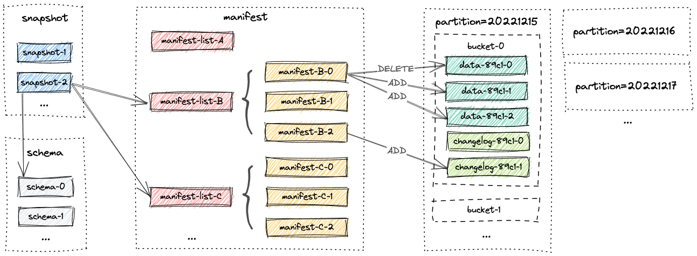
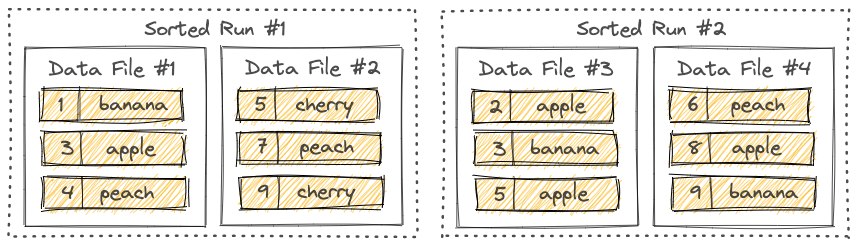

# paimon

## File Layouts
全部文件都存储在basePath基础目录下，从快照文件开始，Paimon Readers可以递归访问表中的所有记录。



### Snapshot Files
所有的快照文件都会存储在`snapshot`目录下，snapshot文件以json格式进行存储，包括下面如下内容
- snapshot对应的记录使用的schema
- 包含了该snapshot对应的所有的变更的manifest list文件信息

一个snapshot文件包含的内容示例：
```json
{
  "version" : 3,
  "id" : 480,
  "schemaId" : 0,
  "baseManifestList" : "manifest-list-bf42f7b7-9225-45ff-96f2-fe0cd2e27392-870",
  "deltaManifestList" : "manifest-list-bf42f7b7-9225-45ff-96f2-fe0cd2e27392-871",
  "changelogManifestList" : null,
  "commitUser" : "6c0ac407-d3b0-4ab3-a78e-0cfec20c73c7",
  "commitIdentifier" : 381,
  "commitKind" : "APPEND",
  "timeMillis" : 1707111413170,
  "logOffsets" : { },
  "totalRecordCount" : 682876,
  "deltaRecordCount" : 1815,
  "changelogRecordCount" : 0,
  "watermark" : -9223372036854775808
}
```

### Manifest Files
- 所有的manifest lists以及manifest文件都存储在了`manifest`目录下
- 清单列表是一个清单文件名列表
- manifest文件是一个包含有关 LSM 数据文件和更新日志文件的更改的文件。例如，在相应快照中创建了哪个 LSM 数据文件，删除了哪个文件。

### LSM Trees
Paimon 采用 LSM 树（日志结构合并树）作为文件存储的数据结构。本文档简要介绍了有关 LSM 树的概念。

#### Sorted Runs
LSM 树将文件组织成多个Sorted Runs。一个Sorted Runs由一个或多个数据文件组成，每个数据文件正好属于一个Sorted Runs。

数据文件中的记录按其主键排序。在一个Sorted Runs中，数据文件的主键范围永远不会重叠。


可以看到，不同的Sorted Runs可能有重叠的主键范围，甚至可能包含相同的主键。在查询 LSM 树时，必须根据用户指定的合并引擎和每条记录的时间戳来合并所有Sorted Runs和具有相同主键的所有记录。
写入 LSM 树的新记录将首先在内存中缓冲。内存缓冲区满后，内存中的所有记录将被排序并刷新到磁盘。现在创建了一个新的Sorted Runs。

#### Compaction
当写入 LSM 树的记录越来越多时，Sorted Runs的数量也会增加。由于查询 LSM 树需要合并所有Sorted Runs，因此过多的Sorted Runs会导致查询性能低下，甚至OOM。
为了限制Sorted Runs的数量，我们必须偶尔将几个Sorted Runs合并成一个大的Sorted Runs。这个过程被称为 "压缩"。
不过，压缩是一个资源密集型过程，需要消耗一定的 CPU 时间和磁盘 IO，因此过于频繁的压缩可能会导致写入速度变慢。这需要在查询和写入性能之间做出权衡。Paimon 目前采用的压缩策略类似于 Rocksdb 的[通用压缩](https://github.com/facebook/rocksdb/wiki/Universal-Compaction)。

默认情况下，Paimon 在向 LSM 树添加记录时，也会根据需要执行compactions。用户也可以选择在专门的compaction作业中执行所有compactions。

