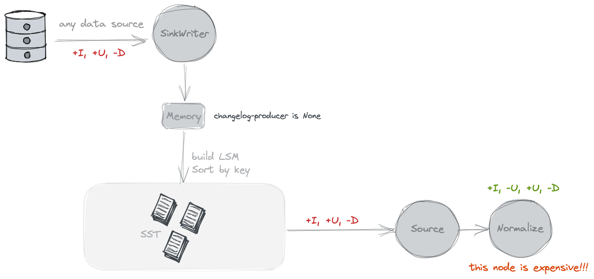
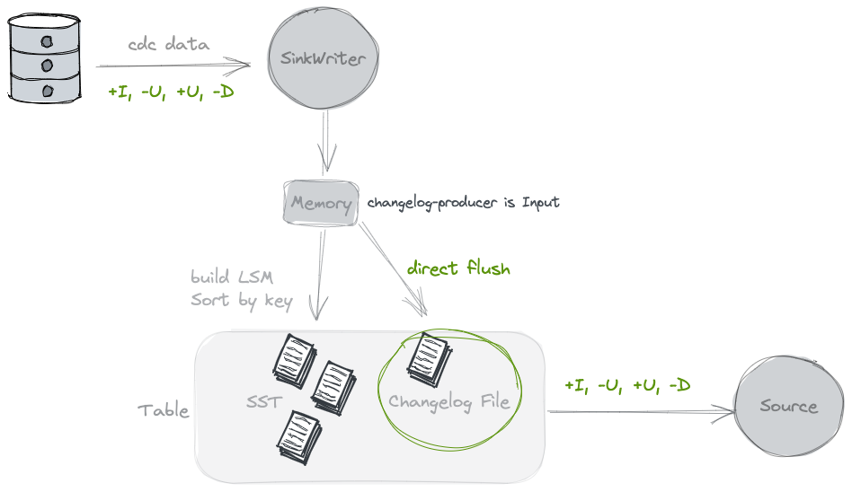
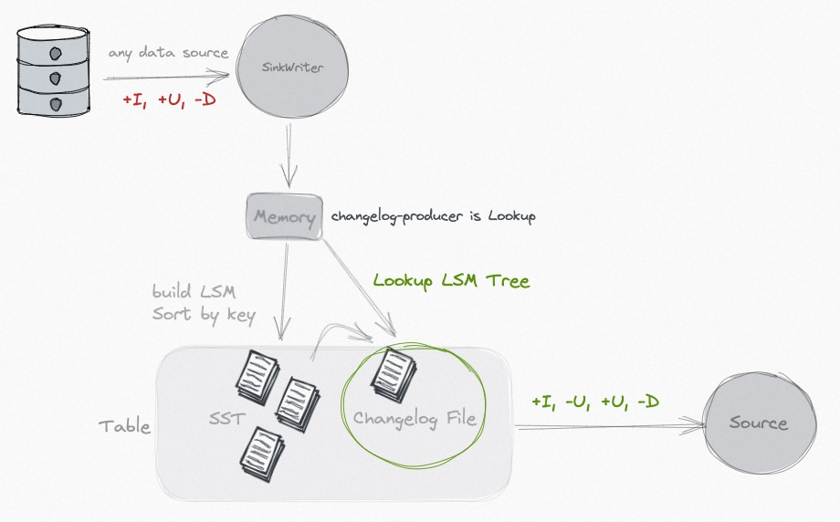
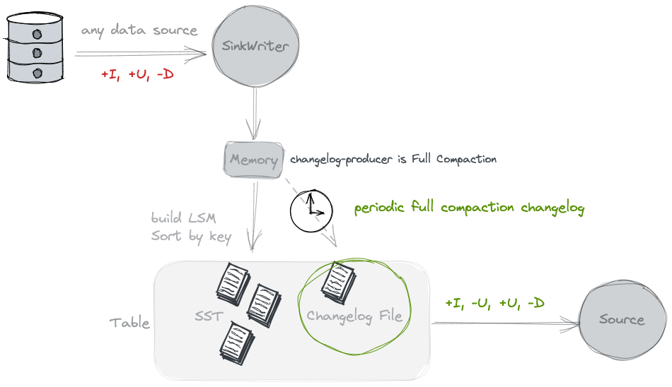

# Primary Key Table
Changelog表是创建表格时的默认表格类型。用户可以在表中插入、更新或删除记录。

主键由一组列组成，每条记录都包含唯一值。Paimon 通过对每个桶内的主键进行排序来执行数据排序，
允许用户通过对主键应用过滤条件来实现高性能。

通过在changelog表中[定义主键]()，用户可以访问以下功能。

## Bucket
存储桶是最小的读写存储单元，每个存储桶目录都包含一棵 [LSM 树](file-layouts.md#lsm-trees)。
### Fixed Bucket
配置一个大于 0 的记录桶，使用Fixed Bucket模式，根据 Math.abs(key_hashcode % numBuckets) 计算记录桶。

只有通过离线处理才能重新缩放存储桶，请参阅[Rescale Bucket]()。
文件桶数量过多会导致小文件过多，而文件桶数量过少则会导致写入性能低下。

### Dynamic Bucket

配置 "bucket"="-1"启用动态桶。首先到达的key将落入旧桶，新key将落入新桶，
桶和密钥的分布取决于数据到达的顺序。Paimon 会维护一个索引，以确定哪个键对应哪个桶。

Paimon 会自动扩充桶的数量。
- Option1: 'dynamic-bucket.target-row-num': controls the target row number for one bucket.
- Option2: 'dynamic-bucket.assigner-parallelism': Parallelism of assigner operator, controls the number of initialized bucket.

> Dynamic Bucket仅支持单个写入作业，不要启动多个作业往同一个分区去写，这会导致数据重复。
> 即使启用 "只写"并启动专门的压缩作业，也不会奏效

#### Normal Dynamic Bucket Mode
当更新不跨分区（无分区或主键包含所有分区字段）时，
动态桶模式使用 HASH 索引来维护键到桶的映射，它比固定桶模式需要更多内存。

性能：
- 一般来说，不会有性能损失，但会额外消耗一些内存，一个分区中的 1 亿个条目会多占用 1 GB 内存，不再活动的分区不会占用内存。
- 对于更新率较低的表格，建议使用该模式，以显著提高性能。

`Normal Dynamic Bucket Mode` supports sort-compact to speed up queries. See [Sort Compact]().

#### Cross Partitions Upsert Dynamic Bucket Mode
当需要跨分区倒插（主键不包含所有分区字段）时，动态桶模式会直接维护键到分区和桶的映射，
使用本地磁盘，并在启动流写任务时通过读取表中的所有现有键来初始化索引。不同的合并引擎有不同的行为：
- 复制：删除旧分区中的数据，将新数据插入新分区。
- 部分更新和聚合：将新数据插入旧分区
- FirstRow： 如果存在旧值，则忽略新数据。

性能：对于数据量较大的表，性能会明显下降。此外，初始化也需要很长时间。

如果 upsert 不依赖于太旧的数据，可以考虑配置索引 TTL，以减少索引和初始化时间：

- `cross-partition-upsert.index-ttl`: 在 rocksdb 索引和初始化中的 TTL，这可以避免维护过多索引，
  导致性能越来越差。

不过要注意的是，这可能导致数据重复。

## Merge Engines

当 Paimon sink 接收到两条或两条以上主键相同的记录时，它会将它们合并为一条记录，
以保持主键的唯一性。通过指定合并引擎表属性，用户可以选择合并记录的方式。

> 一定要在 Flink SQL TableConfig 中将 table.exec.sink.upsert-materialize 设置为 "无"，
  否则 sink upsert-materialize 可能会导致奇怪的行为。当输入不按顺序时，建议使用[序列字段Sequence Field]()来纠正混乱。


### Deduplicate 
`deduplicate`合并引擎是默认的合并引擎。Paimon 只保留最新的记录，而丢弃主键相同的其他记录。

具体来说，如果最新记录是一条 DELETE 记录，那么所有具有相同主键的记录都会被删除。

### 部分更新Partial Update
通过指定 `'merge-engine' = 'partial-update'`，用户可以通过多次更新来更新记录的列，
直到记录完整为止。这是通过使用同一主键下的最新数据逐个更新值字段实现的。但在此过程中，空值不会被覆盖。

例如，假设 Paimon 收到三条记录：
- <1, 23.0, 10, NULL>-
- <1, NULL, NULL, 'This is a book'>
- <1, 25.2, NULL, NULL>

假设第一列是主键，最终结果将是 `<1, 25.2, 10, 'This is a book'>` 。

> 对于流式查询，`partial-update`合并引擎必须跟配置了`lookup`或者`full-compaction`的[changelog producer]()
  一起使用。
> (‘input’ changelog producer is also supported, but only returns input records.) ==> ?没看懂

默认情况下，partial-update不接受删除记录，可以选择以下解决方案之一：
1. 配置`partial-update.ignore-delete`去忽略调删除的记录
2. 配置`sequence-group`s去回退部分咧

#### Sequence Group

序列字段(sequence-field)可能无法解决部分更新表在多数据流更新时的混乱问题，
因为在多数据流更新时，序列字段可能会被另一个数据流的最新数据覆盖。

paimon为partial-update表引入了序列组机制。它可以解决
1. 多流更新时的紊乱。每个数据流都定义了自己的序列组。
2. 真正的部分更新，而不仅仅是非空更新。

example：
```sql
CREATE TABLE T (
    k INT,
    a INT,
    b INT,
    g_1 INT,
    c INT,
    d INT,
    g_2 INT,
    PRIMARY KEY (k) NOT ENFORCED
) WITH (
    'merge-engine'='partial-update',
    'fields.g_1.sequence-group'='a,b',
    'fields.g_2.sequence-group'='c,d'
);

INSERT INTO T VALUES (1, 1, 1, 1, 1, 1, 1);

-- g_2 is null, c, d should not be updated
INSERT INTO T VALUES (1, 2, 2, 2, 2, 2, CAST(NULL AS INT));

SELECT * FROM T; -- output 1, 2, 2, 2, 1, 1, 1

-- g_1 is smaller, a, b should not be updated
INSERT INTO T VALUES (1, 3, 3, 1, 3, 3, 3);

SELECT * FROM T; -- output 1, 2, 2, 2, 3, 3, 3
```
对于字段...sequence-group，有效的比较数据类型包括
DECIMAL、TINYINT、SMALLINT、INTEGER、BIGINT、FLOAT、DOUBLE、DATE、TIME、TIMESTAMP 和 TIMESTAMP_LTZ。


#### Aggregation 

您可以为输入字段指定聚合函数，支持[聚合(Aggregation)]()中的所有函数。

example:
```sql
CREATE TABLE T (
          k INT,
          a INT,
          b INT,
          c INT,
          d INT,
          PRIMARY KEY (k) NOT ENFORCED
) WITH (
     'merge-engine'='partial-update',
     'fields.a.sequence-group' = 'b',
     'fields.b.aggregate-function' = 'first_value',
     'fields.c.sequence-group' = 'd',
     'fields.d.aggregate-function' = 'sum'
 );
INSERT INTO T VALUES (1, 1, 1, CAST(NULL AS INT), CAST(NULL AS INT));
-- output 1,1,1,null,null
INSERT INTO T VALUES (1, CAST(NULL AS INT), CAST(NULL AS INT), 1, 1);
-- output 1,1,1,1,1
INSERT INTO T VALUES (1, 2, 2, CAST(NULL AS INT), CAST(NULL AS INT));
-- output 1,2,1,1,1
INSERT INTO T VALUES (1, CAST(NULL AS INT), CAST(NULL AS INT), 2, 2);
-- output 1,2,1,2,3

SELECT * FROM T; -- output 1, 2, 1, 2, 3

```

#### Default Value
如果无法保证数据的顺序，并且只能通过覆盖空值来写入字段，那么在读取数据表时，未被覆盖的字段将显示为空值。
```sql
CREATE TABLE T (
                  k INT,
                  a INT,
                  b INT,
                  c INT,
                  PRIMARY KEY (k) NOT ENFORCED
) WITH (
     'merge-engine'='partial-update'
     );
INSERT INTO T VALUES (1, 1, CAST(NULL AS INT), CAST(NULL AS INT));
INSERT INTO T VALUES (1, CAST(NULL AS INT), CAST(NULL AS INT), 1);

SELECT * FROM T; -- output 1, 1, null, 1
```
如果希望在读取表格时，未被覆盖的字段有默认值而不是空值，则需要使用 "fields.name.default-value"。

```sql
CREATE TABLE T (
    k INT,
    a INT,
    b INT,
    c INT,
    PRIMARY KEY (k) NOT ENFORCED
) WITH (
    'merge-engine'='partial-update',
    'fields.b.default-value'='0'
);

INSERT INTO T VALUES (1, 1, CAST(NULL AS INT), CAST(NULL AS INT));
INSERT INTO T VALUES (1, CAST(NULL AS INT), CAST(NULL AS INT), 1);

SELECT * FROM T; -- output 1, 1, 0, 1
```

### Aggregation
> 注意：始终将FlinkSQL TableConfig中的`table.exec.sink.upsert-materialize`设置为`NONE`

有时，用户只关心汇总结果。聚合合并引擎会根据聚合函数，在同一主键下逐一聚合带有最新数据的每个值字段。

不属于主键的每个字段都可以使用 `fields.<field-name>.aggregate-function` 表属性指定的聚合函数，
否则将默认使用 `last_non_null_value` 聚合。例如，请看下面的表定义。

```sql
CREATE TABLE MyTable (
    product_id BIGINT,
    price DOUBLE,
    sales BIGINT,
    PRIMARY KEY (product_id) NOT ENFORCED
) WITH (
    'merge-engine' = 'aggregation',
    'fields.price.aggregate-function' = 'max',
    'fields.sales.aggregate-function' = 'sum'
);
```
`price`字段将使用 `max` 函数汇总，`sales`字段将使用 `sum` 函数汇总。
给定两条输入记录 `<1, 23.0, 15>` 和 `<1, 30.2, 20>`，最终结果将是 `<1, 30.2, 35>`。

目前支持的聚合函数和数据类型有
- sum, 求和函数汇总多行的值。它支持 DECIMAL、TINYINT、SMALLINT、INTEGER、BIGINT、FLOAT 和 DOUBLE 数据类型。
- product, 乘积函数可以计算多行的乘积值。它支持 DECIMAL、TINYINT、SMALLINT、INTEGER、BIGINT、FLOAT 和 DOUBLE 数据类型。
- count, 计数函数对多行数值进行计数。它支持 INTEGER 和 BIGINT 数据类型。
- max, max 函数可识别并保留最大值。它支持 CHAR、VARCHAR、DECIMAL、TINYINT、SMALLINT、INTEGER、BIGINT、FLOAT、DOUBLE、DATE、TIME、TIMESTAMP 和 TIMESTAMP_LTZ 数据类型。
- min, min 函数识别并保留最小值。它支持 CHAR、VARCHAR、DECIMAL、TINYINT、SMALLINT、INTEGER、BIGINT、FLOAT、DOUBLE、DATE、TIME、TIMESTAMP 和 TIMESTAMP_LTZ 数据类型。
- last_value, last_value 函数用最近导入的值替换前一个值。它支持所有数据类型。
- last_non_null_value, last_non_null_value 函数用最新的非空值替换前一个值。它支持所有数据类型。
- listagg, listagg 函数将多个字符串值连接成一个字符串。它支持 STRING 数据类型。
- bool_and, The bool_and function evaluates whether all values in a boolean set are true。它支持 BOOLEAN 数据类型。
- bool_or: The bool_or function checks if at least one value in a boolean set is true. 它支持 BOOLEAN 数据类型。
- first_value: The first_value function retrieves the first null value from a data set. It supports all data types.
- first_not_null_value: The first_not_null_value function selects the first non-null value in a data set. It supports all data types.
- nested-update: The nested-update function collects multiple rows into one array (so-called ‘nested table’). It supports ARRAY data types.

#### nested-update
使用 `fields.<field-name>.nested-key=pk0,pk1,...` 去指定nested table的主键，如果没有主键则新的一行会
追加到array里。

example:
```sql
-- orders table
CREATE TABLE orders (
  order_id BIGINT PRIMARY KEY NOT ENFORCED,
  user_name STRING,
  address STRING
);

-- sub orders that have the same order_id 
-- belongs to the same order
CREATE TABLE sub_orders (
  order_id BIGINT,
  sub_order_id INT,
  product_name STRING,
  price BIGINT,
  PRIMARY KEY (order_id, sub_order_id) NOT ENFORCED
);

-- wide table
CREATE TABLE order_wide (
  order_id BIGINT PRIMARY KEY NOT ENFORCED,
  user_name STRING,
  address STRING,
  sub_orders ARRAY<ROW<sub_order_id BIGINT, product_name STRING, price BIGINT>>
) WITH (
  'merge-engine' = 'aggregation',
  'fields.sub_orders.aggregate-function' = 'nested-update',
  'fields.sub_orders.nested-key' = 'sub_order_id'
);

INSERT INTO orders VALUES (1,'user1','shanghai');
INSERT INTO sub_orders VALUES (1,1,'iphone',799),
                              (1,2,'ipad',699);

-- TODO 待实操
-- widen
INSERT INTO order_wide

SELECT
  order_id,
  user_name,
  address,
  CAST (NULL AS ARRAY<ROW<sub_order_id BIGINT, product_name STRING, price BIGINT>>)
FROM orders

UNION ALL

SELECT
  order_id,
  CAST (NULL AS STRING),
  CAST (NULL AS STRING),
  ARRAY[ROW(sub_order_id, product_name, price)]
FROM sub_orders;

-- query using UNNEST
SELECT order_id, user_name, address, sub_order_id, product_name, price
FROM order_wide, UNNEST(sub_orders) AS so(sub_order_id, product_name, price)
```

只有 `sum` 和 `product` 支持撤回（`UPDATE_BEFORE` 和 `DELETE`），其他聚合函数不支持撤回。
如果允许某些函数忽略撤回信息，可以配置`fields.${field_name}.ignore-retract'='true'`。


#### First Row
通过指定 `'merge-engine' = 'first-row'`，用户可以保留同一主键的第一行。
它与deduplicate引擎的不同之处在于，在`first-row`引擎中，它将只生成插入更新日志(insert only changelog)。

> 1. `first-row` 合并引擎必须跟lookup changelog producer一起使用.
> 2. 不允许指定 `sequence.field`.
> 3. 无法接受`DELETE` 和 `UPDATE_BEFORE`消息.可以通过配置`first-row.ignore-delete` 去忽略这两种类型的记录

这对于在流式计算中取代重复数据删除日志大有帮助。


## Changelog Producers

什么是changelog producers?
流式查询会持续产生最近的记录
通过在创建表格时指定 changelog-producer 表属性，用户可以选择从表格文件中生成更改的模式。

> The changelog-producer table property only affects changelog from table files. 
> It does not affect the external log system.


### None
根据默认设置，表的写入操作不会应用额外的变更日志生成器。
Paimon源只能查看快照之间合并的变更，比如哪些键被移除以及某些键的新值是什么。

然而，这些合并的变更不能形成完整的变更日志，因为我们无法直接从中读取键的旧值。
合并的变更需要消费者“记住”每个键的值，并在看不到旧值的情况下重新写入这些值。
然而，某些消费者需要旧值来确保正确性或效率。

考虑一个计算某些分组键上的总和的消费者（可能不等于主键）。
如果消费者只看到一个新值5，它无法确定应该将哪些值添加到总和结果中。
例如，如果旧值是4，它应该在结果中加1。但如果旧值是6，它应该在结果中减1。
对于这些类型的消费者来说，旧值非常重要。

因此，对于诸如数据库系统之类的消费者来说，不使用变更日志生成器是最合适的。
Flink还具有内置的“normalize”运算符，它会在状态中持久保存每个键的值。
正如大家可以轻易看出的那样，这个运算符将非常昂贵，
应该避免使用（可以通过 'scan.remove-normalize' 强制移除“normalize”运算符）。



### Input

指定 `'changelog-producer' = 'input'`使用，Paimon 写入者依赖它们的输入作为完整 changelog 的来源。
所有输入记录将被保存在单独的 changelog 文件中，并将由 Paimon 源提供给消费者。

当 Paimon 写入者的输入是完整的 changelog 时，例如来自数据库 CDC 或由 Flink stateful 计算生成时，
可以使用 input changelog producer。



### Lookup

如果您的输入无法生成完整的更改日志，但仍希望摆脱昂贵的normalized操作符，
可以考虑使用`'lookup'`更改日志生成器。
通过指定`'changelog-producer' = 'lookup'`，Paimon将在提交数据写入之前通过`'lookup'`生成更改日志。


`Lookup`会在内存、本地磁盘上缓存数据，可以通过下面的方式提升性能

| Option                       | Default   | Type       | Description                                       |
|------------------------------|-----------|------------|---------------------------------------------------|
| lookup.cache-file-retention  | 1h        | Duration   | 缓存文件的保留时间用于lookup。文件过期后，如果需要访问，将从DFS重新读取，以在本地磁盘上构建索引。 |
| lookup.cache-max-disk-size   | unlimited | MemorySize | 用于lookup缓存的最大磁盘大小                                 |
| lookup.cache-max-memory-size | 256mb     | MemorySize | 用于lookup缓存的最大内存大小                                 |


Lookup changelog-producer支持通过配置`changelog-producer.row-deduplicate`以避免为相同记录生成`-U`,`+U`的changelog

> 注意: 提高`execution.checkpointing.max-concurrent-checkpoints`可以提升lookup性能

### Full Compaction

如果觉得lookup消耗的资源比较多的话，可以使用`full-compaction`替代。
这玩意将data writing和changelog生成解耦，更适合对延迟不太敏感的业务（比如10分钟）

可以通过指定`'changelog-producer' = 'full-compaction'`使用，
Paimon将比较完整压缩的结果，并将差异生成为changelog。changelog的延迟受到full-compaction频率的影响。

通过指定`full-compaction.delta-commits`表属性，full-compaction将在增量提交（检查点）后不断触发。
默认设置为1，因此每次checkpoint都将进行full-compaction并生成changelog。



> Full compaction changelog producer可以为任何类型的源生成完整的changelog。
> 然而，它不像input changelog producer那样高效，生成changelog的延迟可能较高。

Lookup changelog-producer支持通过配置`changelog-producer.row-deduplicate`以避免为相同记录生成`-U`,`+U`的changelog

> 注意: 提高`execution.checkpointing.max-concurrent-checkpoints`可以提升lookup性能

## Sequence Field


