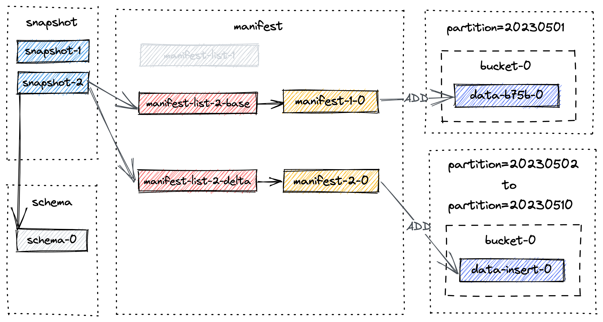
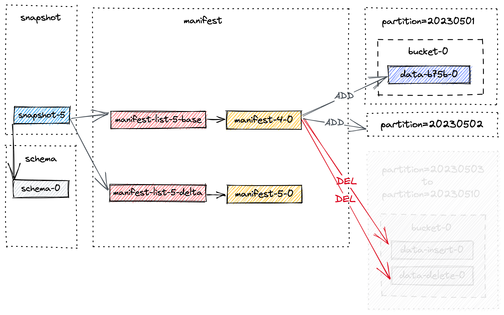

# Understand Files

## Understand File Operations

```sql
-- create catalog
CREATE CATALOG paimon WITH (
'type' = 'paimon',
'warehouse' = 'file:///tmp/paimon'
);

USE CATALOG paimon;
-- create paimon table
-- 创建表会创建/tmp/paimon/default.db/T目录，并且在该目录下的schema/目录下创建一个schema-0文件保存表定义
CREATE TABLE T (
                   id BIGINT,
                   a INT,
                   b STRING,
                   dt STRING COMMENT 'timestamp string in format yyyyMMdd',
                   PRIMARY KEY(id, dt) NOT ENFORCED
) PARTITIONED BY (dt);


```

### 写入数据
```sql
-- insert 
INSERT INTO T VALUES (1, 10001, 'varchar00001', '20230501');
```

一旦flink job完成，也就意味着一次commit成功了，记录也就成功写入了paimon表。
提交过程会在`/tmp/paimon/default.db/T/snapshot`目录下创建一个snapshot文件`snapshot-1`


`snapshot-1`文件长这样：
```json
{
  "version" : 3,
  "id" : 1,
  "schemaId" : 0,
  "baseManifestList" : "manifest-list-83aa353d-0e80-48af-8c74-2f790062cb58-0",
  "deltaManifestList" : "manifest-list-83aa353d-0e80-48af-8c74-2f790062cb58-1",
  "changelogManifestList" : null,
  "commitUser" : "f9fbfcbc-08b3-4ac1-8f27-3719852e7c0e",
  "commitIdentifier" : 9223372036854775807,
  "commitKind" : "APPEND",
  "timeMillis" : 1707206538457,
  "logOffsets" : { },
  "totalRecordCount" : 1,
  "deltaRecordCount" : 1,
  "changelogRecordCount" : 0,
  "watermark" : -9223372036854775808
}
```

manifest list包含了所有snapshot的更改信息，`baseManifestList` 是应用在 `deltaManifestList`
中更改的基本文件。第一个提交将导致生成 1 个清单文件，并创建2个清单列表:
```bash
➜  T ls -lh manifest
total 12K
-rw-rw-r-- 1 root root 1.7K 2月   6 16:02 manifest-f5a58477-2362-429c-a254-7b8d48d2fe99-0
-rw-rw-r-- 1 root root  676 2月   6 16:02 manifest-list-83aa353d-0e80-48af-8c74-2f790062cb58-0
-rw-rw-r-- 1 root root  798 2月   6 16:02 manifest-list-83aa353d-0e80-48af-8c74-2f790062cb58-1
```

- `manifest-f5a58477-2362-429c-a254-7b8d48d2fe99-0`存储snapshot中数据文件的信息
- `manifest-list-83aa353d-0e80-48af-8c74-2f790062cb58-0`，是baseManifestList,因为是第一次commit，所以是空的
- `manifest-list-83aa353d-0e80-48af-8c74-2f790062cb58-1`是deltaManifestList, 包含了对数据文件进行的操作的manifest实体，也就是`manifest-f5a58477-2362-429c-a254-7b8d48d2fe99-0`


写入一批数据后看看发生了什么
```sql
INSERT INTO T VALUES 
(2, 10002, 'varchar00002', '20230502'),
(3, 10003, 'varchar00003', '20230503'),
(4, 10004, 'varchar00004', '20230504'),
(5, 10005, 'varchar00005', '20230505'),
(6, 10006, 'varchar00006', '20230506'),
(7, 10007, 'varchar00007', '20230507'),
(8, 10008, 'varchar00008', '20230508'),
(9, 10009, 'varchar00009', '20230509'),
(10, 10010, 'varchar00010', '20230510');
```

```
➜  T tree .
.
├── dt=20230501
│   └── bucket-0
│       └── data-2a0818ee-666b-4298-b3e6-79391a0a86e4-0.orc
├── dt=20230502
│   └── bucket-0
│       └── data-ea53dd0c-2870-4a7c-b302-50c06d1b5b6f-0.orc
├── dt=20230503
│   └── bucket-0
│       └── data-fbe0b049-040b-4b4f-aaf1-77ac39a4ab16-0.orc
├── dt=20230504
│   └── bucket-0
│       └── data-48510768-0575-44ae-b6db-31ee513176c6-0.orc
├── dt=20230505
│   └── bucket-0
│       └── data-3757551f-279f-409b-8271-838aa7d9e4e2-0.orc
├── dt=20230506
│   └── bucket-0
│       └── data-cc9b0904-b030-4d67-833f-b23cbb090cf1-0.orc
├── dt=20230507
│   └── bucket-0
│       └── data-925c3e4c-b177-4419-aa24-ba8874ff2bd7-0.orc
├── dt=20230508
│   └── bucket-0
│       └── data-bcbe079f-8da4-4fff-87d5-dd7127638abd-0.orc
├── dt=20230509
│   └── bucket-0
│       └── data-d702af85-c077-44f1-bfed-79da4ec5fc51-0.orc
├── dt=20230510
│   └── bucket-0
│       └── data-51b3ce6f-0a3e-4aac-9b00-eb9fdd7110af-0.orc
├── manifest
│   ├── manifest-73e45d35-a75f-42d2-9e33-396b66b0e44b-0 # manifest for snapshot-2
│   ├── manifest-f5a58477-2362-429c-a254-7b8d48d2fe99-0 # manifest for snapshot-1
│   ├── manifest-list-83aa353d-0e80-48af-8c74-2f790062cb58-0 # baseManifestList for snapshot-1
│   ├── manifest-list-83aa353d-0e80-48af-8c74-2f790062cb58-1 # deltaManifestList for snapshot-1
│   ├── manifest-list-aa733556-6104-4cb5-968c-9956575bfb7c-0 # baseManifestList for snapshot-2
│   └── manifest-list-aa733556-6104-4cb5-968c-9956575bfb7c-1 # deltaManifestList for snapshot-2
├── schema
│   └── schema-0
└── snapshot
    ├── EARLIEST
    ├── LATEST
    ├── snapshot-1
    └── snapshot-2
```

新的文件布局长这样



### 从表中删数据
> TODO 当前测试环境为flink1.16.3不支持delete操作

```sql
set 'execution.runtime-mode' = 'batch';
delete from T where dt >= '20230503';
```

执行完后会触发第三次commit并且生成snapshot-3，该操作不仅不会删除原有的数据文件，
而且dt在`[20230503, 20230510]`区间的分区下的bucket-0文件夹中都多出了一个orc文件

```bash
./T/dt=20230510/bucket-0:
data-b93f468c-b56f-4a93-adc4-b250b3aa3462-0.orc # newer data file created by the delete statement 
data-0fcacc70-a0cb-4976-8c88-73e92769a762-0.orc # older data file created by the insert statement
```

查询下会发现就剩2条数据了
```sql
+I[1, 10001, 'varchar00001', '20230501']
+I[2, 10002, 'varchar00002', '20230502']
```

此时文件布局如下，baseManifestList-3包含前面两次的manifest(manifest-1-0, manifest-2-0)。
manifest-3-0包含了8个`ADD`操作类型的manifest实体，对应着8个新写入的`data-delete-*`文件


### compact table

从上面可以看出，随着snapshot的增加小文件也会增加，这可能会导致读性能的下降。
因此需要进行full-compaction去减少小文件的数量。

```bash
<FLINK_HOME>/bin/flink run \
    -D execution.runtime-mode=batch \
    /path/to/paimon-flink-action-0.6.0-incubating.jar \
    compact \
    --warehouse <warehouse-path> \
    --database <database-name> \ 
    --table <table-name> \
    [--partition <partition-name>] \
    [--catalog_conf <paimon-catalog-conf> [--catalog_conf <paimon-catalog-conf> ...]] \
    [--table_conf <paimon-table-dynamic-conf> [--table_conf <paimon-table-dynamic-conf>] ...]
```
exmaple：
```bash
./bin/flink run \
    ./lib/paimon-flink-action-0.6.0-incubating.jar \
    compact \
    --path file:///tmp/paimon/default.db/T
```

执行完后生成了snapshot-4
```json
{
  "version" : 3,
  "id" : 4,
  "schemaId" : 0,
  "baseManifestList" : "manifest-list-9be16-82e7-4941-8b0a-7ce1c1d0fa6d-0",
  "deltaManifestList" : "manifest-list-9be16-82e7-4941-8b0a-7ce1c1d0fa6d-1",
  "changelogManifestList" : null,
  "commitUser" : "a3d951d5-aa0e-4071-a5d4-4c72a4233d48",
  "commitIdentifier" : 9223372036854775807,
  "commitKind" : "COMPACT",
  "timeMillis" : 1684163217960,
  "logOffsets" : { },
  "totalRecordCount" : 38,
  "deltaRecordCount" : 20,
  "changelogRecordCount" : 0,
  "watermark" : -9223372036854775808
}
```

snapshot-4时的文件布局：


`manifest-4-0`包含了20个manifest实体（18个delete操作，2个insert操作） ==> 没太搞懂
- For partition 20230503 to 20230510, two DELETE operations for two data files
- For partition 20230501 to 20230502, one DELETE operation and one ADD operation for the same data file.


### Alter Table
执行下面sql配置`full-compaction`，该操作会为paimon表创建一个新的schema(schema-1)，
这时候不会有任何snapshot应用该schema，会在下一次commit的时候才会采用该schema
```sql
ALTER TABLE T SET ('full-compaction.delta-commits' = '1');
```

### Expire Snapshot

在snapshot过期且消费者不再依赖snapshot之前，标记的数据文件不会被真正删除。

在快照过期过程中，首先确定快照的范围，然后标记这些快照中的数据文件进行删除。
只有当有一个 `DELETE` 类型的manifest entry引用了该特定数据文件时，才会标记为要删除的数据文件。
这种标记可确保该文件不会被后续快照使用，并可安全删除。

假设上图中的 4 个快照都即将过期。过期过程如下：
- 它首先删除所有标记的数据文件，并记录所有已更改的bucket。
- 然后删除所有changelog文件和相关manifests文件。
- 最后，它会删除snapshot本身，并写入最早的提示文件(`EARLIEST`)。

如果删除进程结束后有任何目录为空，它们也会被删除。

假设创建了另一个snapshot，即snapshot-5，并触发了snapshot expiration。
`snapshot-1`到`snapshot-4`将被删除。
为简单起见，我们只关注之前snapshot中的文件，snapshot过期后的最终布局如下所示：



最终分区`[20230503, 20230510]`下的文件以及其目录本身都会被删除。

### Flink Stream Write


